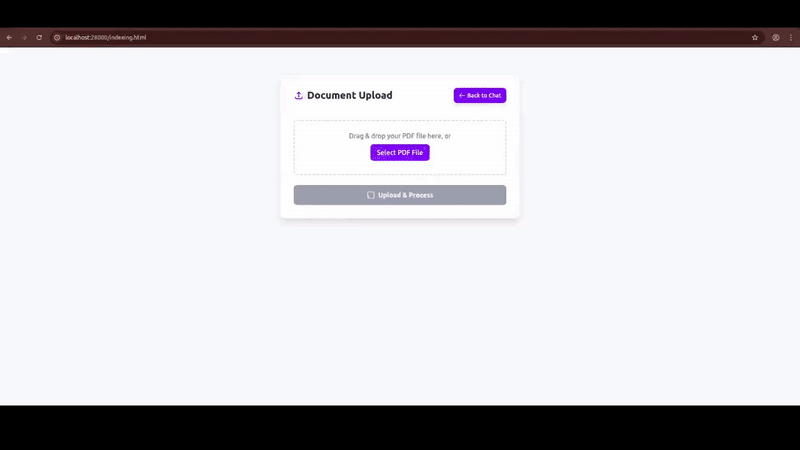

# OcsAI

This repository serves as a practical guide for newcomers to AI agents, offering clear, hands-on examples of core concepts like Indexing, Embedding, RAG, and advanced retrieval techniques such as RAG-Fusion and RAG Fallback, ...

# Getting Started

## Server Requirements

- Python >= 3.12
- chromadb >= 1.3
- fastapi >= 0.115.12
- langchain >= 1.1.0

## Installing preparation

1. Default Application $BASEPATH : `/home/app.user/ocs-ai`

2. Copy the .env file from .env.example under $BASEPATH, fill your config in .env file instead of example config

# Build with Docker

## Setup docker

```bash
  docker compose up -d --build
```

## Run dev mode

```bash
  docker compose exec app poetry run poe dev
  # Or:
  make dev
```

## Local url

Chat: http://localhost:28000

Indexing: http://localhost:28000/indexing.html


## 📺 Demo


